# R5 Technical Agent Report: W29

## Cross-Asset Technical Matrix

| Asset | Close | EMA 8 | EMA 21 | Support | Resistance | Trend | Bias | Confidence |
|---|---:|---:|---:|---:|---:|---|---|---|
| SPX | 7,457.69 | 7,515.12 | 7,491.37 | 7,421.82 | 7,517.12 | Pullback / Weakening | Slightly Bearish | Low |
| NDX | 28,592.66 | 29,236.69 | 29,427.65 | 28,567.16 | 29,678.89 | Bearish | Bearish | Medium |
| IWM | 294.04 | 295.29 | 294.83 | 290.68 | 297.91 | Pullback / Weakening | Slightly Bearish | Low |
| XLK | 175.59 | 180.42 | 182.38 | 172.88 | 180.22 | Bearish | Bearish | Medium |
| XLU | 45.17 | 45.39 | 45.28 | 45.04 | 45.50 | Pullback / Weakening | Slightly Bearish | Low |
| XLF | 56.26 | 56.07 | 55.09 | 54.95 | 56.59 | Bullish / Recovery | Bullish | Medium |
| XLE | 57.68 | 56.35 | 55.69 | 55.99 | 59.04 | Bullish / Recovery | Bullish | Medium |
| XLB | 50.53 | 50.73 | 50.96 | 50.50 | 51.45 | Bearish | Bearish | Medium |
| XLY | 115.44 | 116.46 | 116.54 | 114.44 | 119.21 | Bearish | Bearish | Medium |
| XLP | 85.19 | 84.51 | 84.25 | 83.44 | 85.22 | Bullish / Recovery | Bullish | Medium |
| XLV | 161.09 | 160.57 | 158.66 | 148.79 | 165.61 | Bullish / Recovery | Bullish | Medium |
| XLI | 179.41 | 180.58 | 180.37 | 179.08 | 182.92 | Pullback / Weakening | Slightly Bearish | Low |
| XLC | 110.65 | 111.35 | 110.80 | 110.12 | 112.27 | Pullback / Weakening | Slightly Bearish | Low |
| XLRE | 45.42 | 44.87 | 44.65 | 44.05 | 45.65 | Bullish / Recovery | Bullish | Medium |

## S&P 500 (SPX)

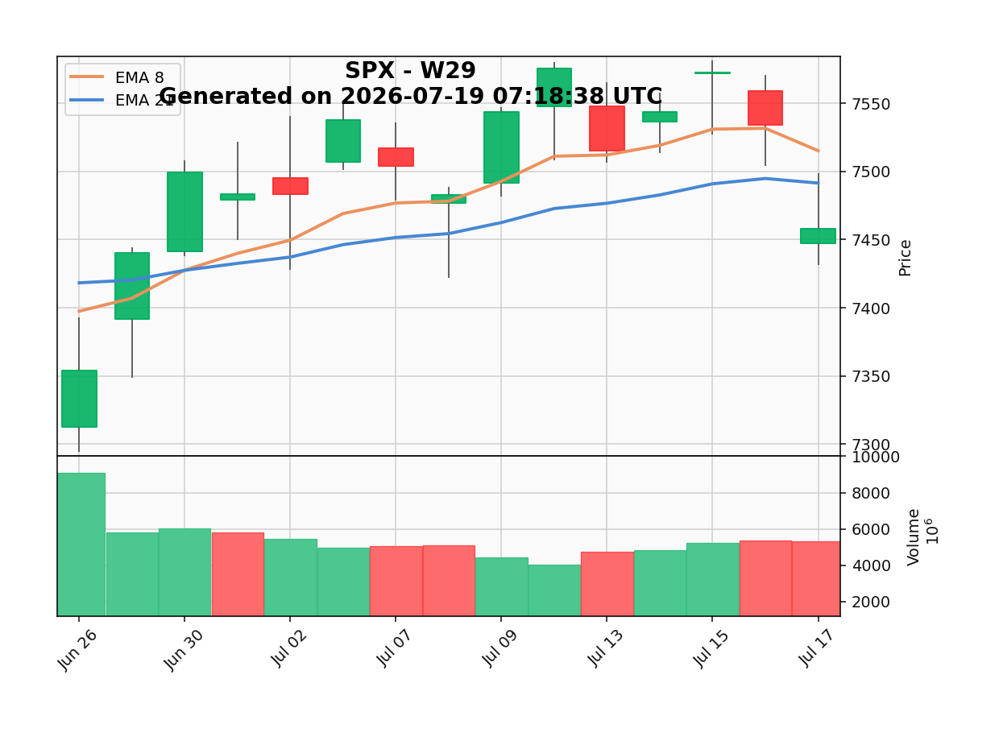

- **Close price:** 7,457.69
- **EMA 8:** 7,515.12
- **EMA 21:** 7,491.37
- **Support:** 7,421.82
- **Resistance:** 7,517.12
- **Trend:** Pullback / Weakening
- **Bias:** Slightly Bearish
- **Confidence:** Low

## NASDAQ 100 (NDX)

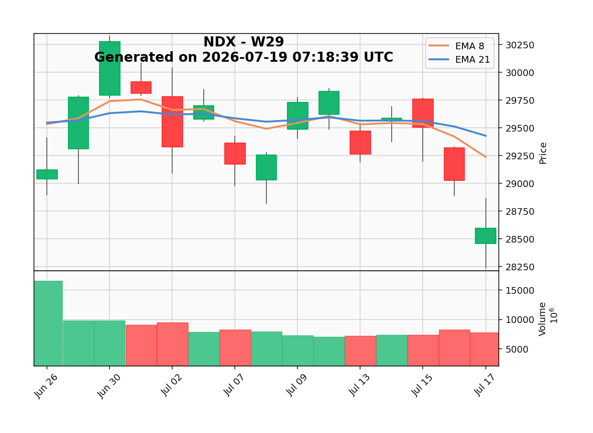

- **Close price:** 28,592.66
- **EMA 8:** 29,236.69
- **EMA 21:** 29,427.65
- **Support:** 28,567.16
- **Resistance:** 29,678.89
- **Trend:** Bearish
- **Bias:** Bearish
- **Confidence:** Medium

## Russell 2000 ETF (IWM)

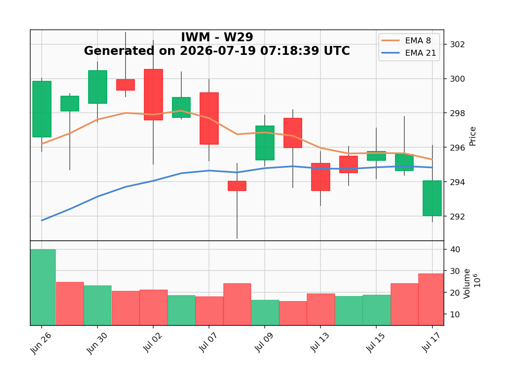

- **Close price:** 294.04
- **EMA 8:** 295.29
- **EMA 21:** 294.83
- **Support:** 290.68
- **Resistance:** 297.91
- **Trend:** Pullback / Weakening
- **Bias:** Slightly Bearish
- **Confidence:** Low

## Technology (XLK)

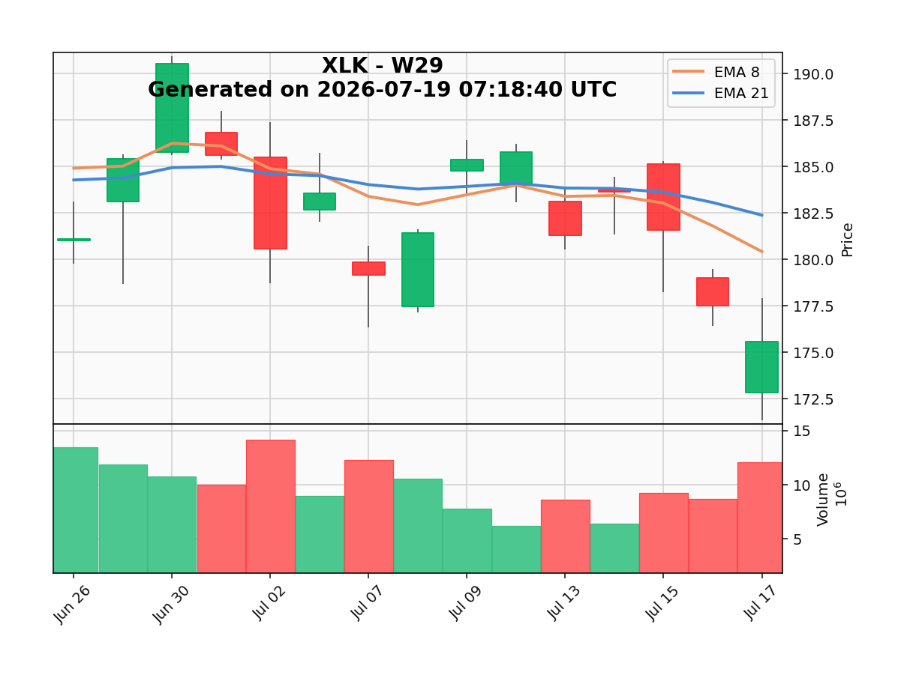

- **Close price:** 175.59
- **EMA 8:** 180.42
- **EMA 21:** 182.38
- **Support:** 172.88
- **Resistance:** 180.22
- **Trend:** Bearish
- **Bias:** Bearish
- **Confidence:** Medium

## Utilities (XLU)

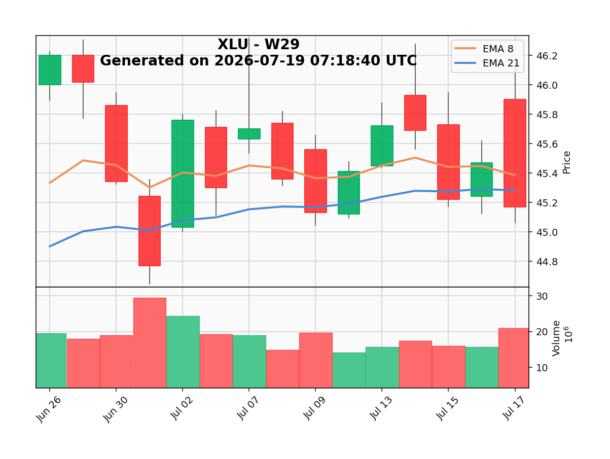

- **Close price:** 45.17
- **EMA 8:** 45.39
- **EMA 21:** 45.28
- **Support:** 45.04
- **Resistance:** 45.50
- **Trend:** Pullback / Weakening
- **Bias:** Slightly Bearish
- **Confidence:** Low

## Financials (XLF)

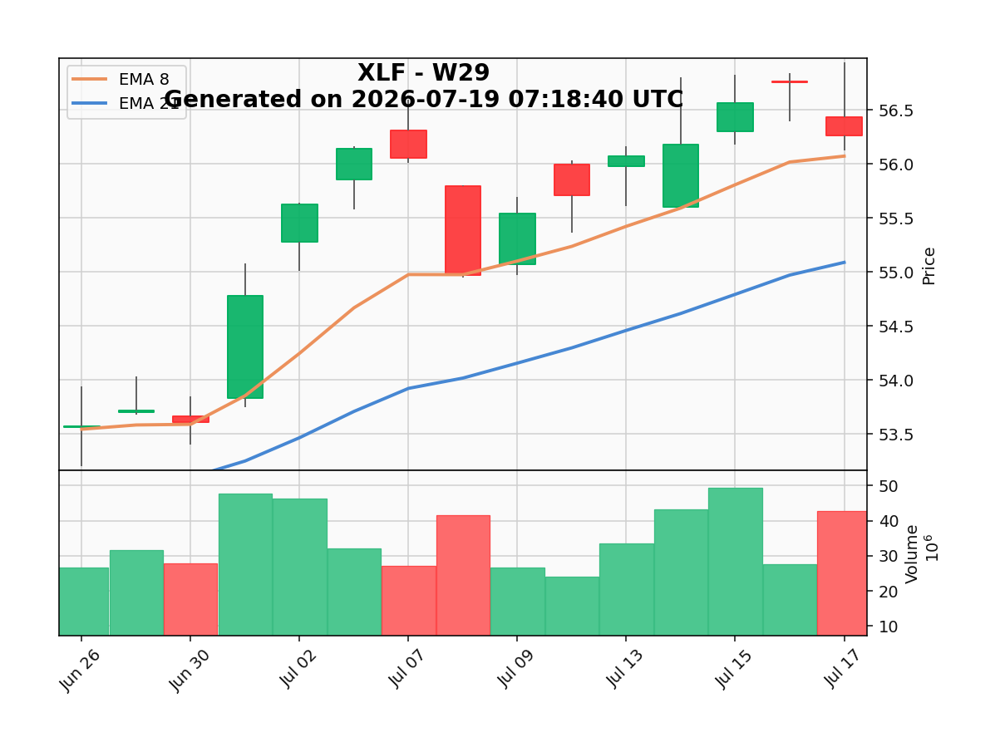

- **Close price:** 56.26
- **EMA 8:** 56.07
- **EMA 21:** 55.09
- **Support:** 54.95
- **Resistance:** 56.59
- **Trend:** Bullish / Recovery
- **Bias:** Bullish
- **Confidence:** Medium

## Energy (XLE)

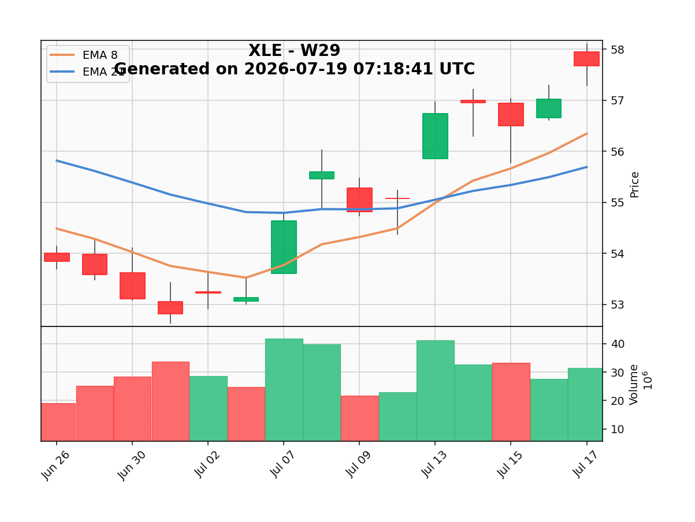

- **Close price:** 57.68
- **EMA 8:** 56.35
- **EMA 21:** 55.69
- **Support:** 55.99
- **Resistance:** 59.04
- **Trend:** Bullish / Recovery
- **Bias:** Bullish
- **Confidence:** Medium

## Materials (XLB)

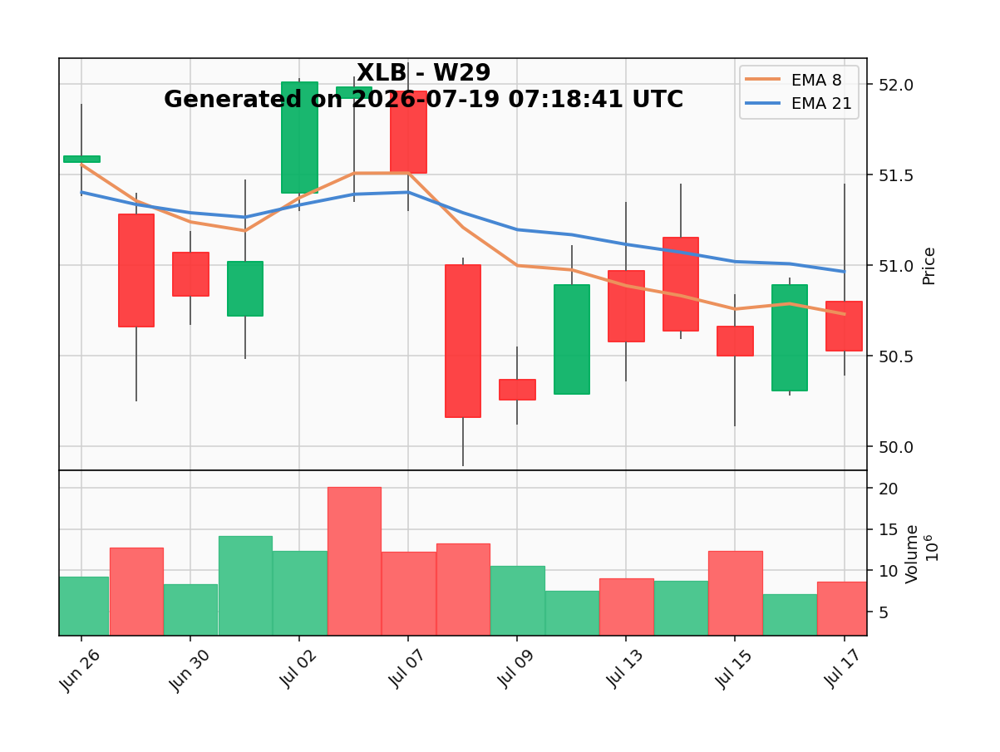

- **Close price:** 50.53
- **EMA 8:** 50.73
- **EMA 21:** 50.96
- **Support:** 50.50
- **Resistance:** 51.45
- **Trend:** Bearish
- **Bias:** Bearish
- **Confidence:** Medium

## Consumer Discretionary (XLY)

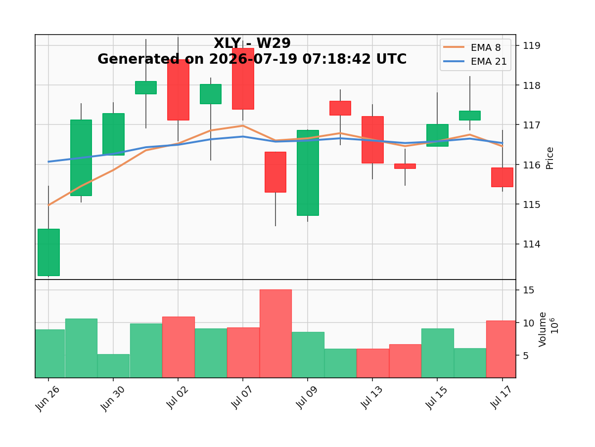

- **Close price:** 115.44
- **EMA 8:** 116.46
- **EMA 21:** 116.54
- **Support:** 114.44
- **Resistance:** 119.21
- **Trend:** Bearish
- **Bias:** Bearish
- **Confidence:** Medium

## Consumer Staples (XLP)

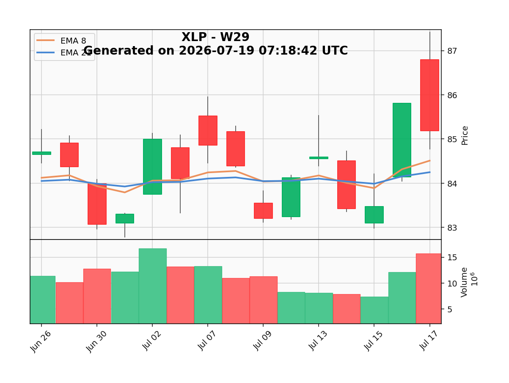

- **Close price:** 85.19
- **EMA 8:** 84.51
- **EMA 21:** 84.25
- **Support:** 83.44
- **Resistance:** 85.22
- **Trend:** Bullish / Recovery
- **Bias:** Bullish
- **Confidence:** Medium

## Health Care (XLV)

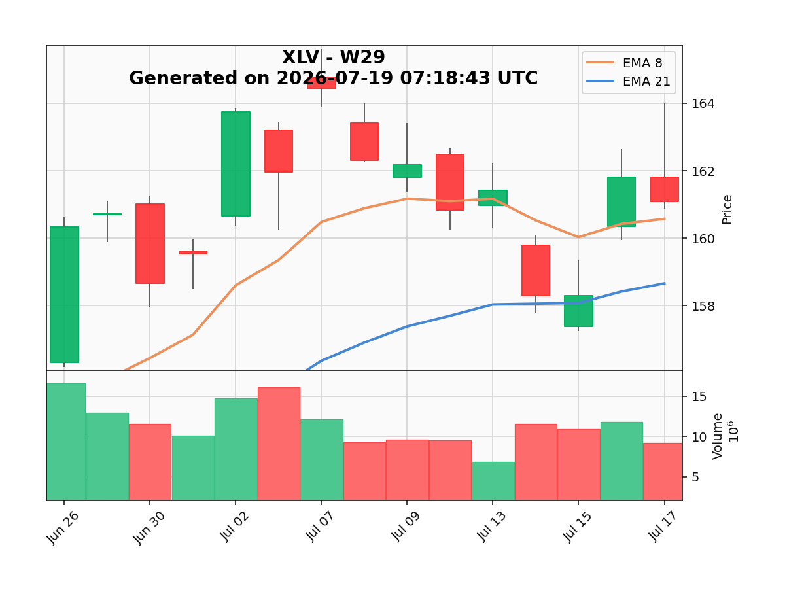

- **Close price:** 161.09
- **EMA 8:** 160.57
- **EMA 21:** 158.66
- **Support:** 148.79
- **Resistance:** 165.61
- **Trend:** Bullish / Recovery
- **Bias:** Bullish
- **Confidence:** Medium

## Industrials (XLI)

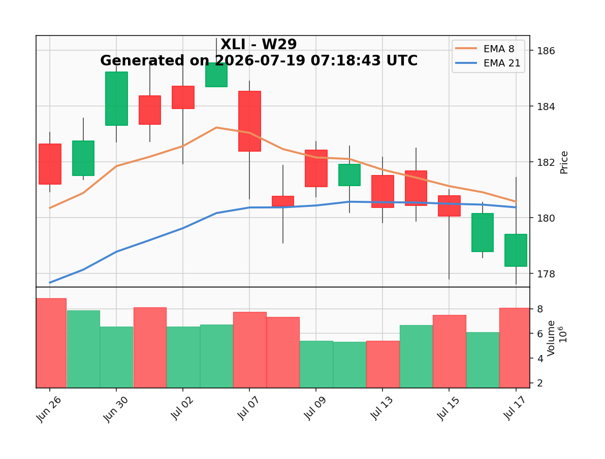

- **Close price:** 179.41
- **EMA 8:** 180.58
- **EMA 21:** 180.37
- **Support:** 179.08
- **Resistance:** 182.92
- **Trend:** Pullback / Weakening
- **Bias:** Slightly Bearish
- **Confidence:** Low

## Communication Services (XLC)

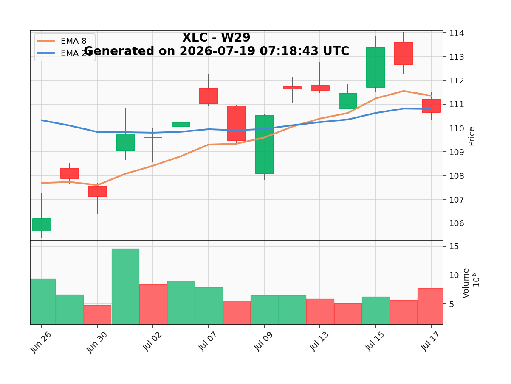

- **Close price:** 110.65
- **EMA 8:** 111.35
- **EMA 21:** 110.80
- **Support:** 110.12
- **Resistance:** 112.27
- **Trend:** Pullback / Weakening
- **Bias:** Slightly Bearish
- **Confidence:** Low

## Real Estate (XLRE)

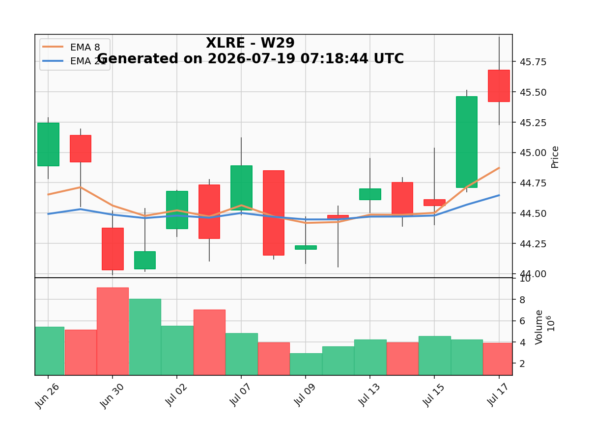

- **Close price:** 45.42
- **EMA 8:** 44.87
- **EMA 21:** 44.65
- **Support:** 44.05
- **Resistance:** 45.65
- **Trend:** Bullish / Recovery
- **Bias:** Bullish
- **Confidence:** Medium

## Methodology Note

The JSON writer rejects NaN and infinity. Invalid core prices cause the workflow to fail instead of publishing incorrect values.
